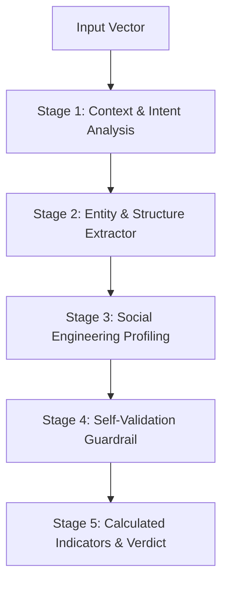

# 🛡️ ScamShield AI - Think Before You Trust

[](https://scamshield-ai-cfij.onrender.com/dashboard)
[](https://opensource.org/licenses/MIT)
[](https://reactjs.org/)
[](https://tailwindcss.com/)
[](https://flask.palletsprojects.com/)
[](https://deepmind.google/)

---

## 🌟 Executive Summary

**ScamShield AI** is an enterprise-grade SaaS cybersecurity web application built to defend individuals and organizations against sophisticated digital fraud. Millions of users daily fall prey to phishing emails, fake UPI payment QR traps, Telegram task scams, brand impersonation websites, and coercive SMS notices. 

ScamShield AI replaces simple static keyword matchers with a **Multi-Stage Evidence Reasoning AI Engine** that performs deep semantic NLP parsing, entity extraction, psychological manipulation profiling, and evidence-grounded threat scoring.

🔗 **Live Production URL**: [https://scamshield-ai-cfij.onrender.com/dashboard](https://scamshield-ai-cfij.onrender.com/dashboard)

---

## 🚀 Key Modules & Threat Vectors

### 1. 💬 Message Threat Scanner (`/scan/message`)
- Analyzes text across SMS, WhatsApp, Telegram, Email, Instagram, Discord, and LinkedIn.
- Evaluates urgency cues, financial coercion, emotional manipulation, and credential theft risk.
- Highlights exact suspicious phrases with interactive tooltips and provides evidence-based action checklists.

### 2. 🌐 Website & Domain Scanner (`/scan/website`)
- Evaluates target URLs for typosquatting/brand impersonation against top 100 corporate brands (Levenshtein distance).
- Calculates estimated domain registration age, verifies HTTPS & SSL validity, and tracks redirect hops.

### 3. 📧 Email Phishing Auditor (`/scan/email`)
- Audits email headers for webmail domain spoofing (e.g. `support@paypal-security-update.com` vs `@paypal.com`).
- Scans subject lines for coercive time limits and identifies dangerous attachment extensions (`.exe`, `.iso`, `.vbs`, `.scr`).

### 4. 📱 QR Code & Payment Scanner (`/scan/qr`)
- Decodes QR payloads, detects fake UPI payment collect links (`upi://pay`), short URL expanders, and unverified payment gateways.
- Enforces the core security rule: *"Entering a UPI PIN is ONLY to send money, NEVER to receive money."*

### 5. 🖼️ Image OCR & Screenshot Scanner (`/scan/image`)
- Upload screenshots of WhatsApp chats, bank SMS notices, posters, or payment receipts (PNG, JPG, WEBP).
- Preprocesses images on HTML5 Canvas (grayscale & contrast boost) for **Tesseract OCR** text extraction and automatic **QR code detection**.

### 6. 📞 Phone Fraud Lookup (`/scan/phone`)
- Cross-references caller numbers against community spam databases, fraud report counts, and robocall categories.
- Includes an interactive modal for users to submit new scam phone numbers to the global threat index.

### 7. 🤖 AI Security Advisor Chat (`/chat`)
- ChatGPT-like conversational cybersecurity expert providing real-time safety guidance, scam explanations, and threat mitigation steps.

### 8. 📊 Scan History & Commercial PDF Generator (`/history`)
- Complete data grid featuring live search, vector filtering, risk sorting, favorite toggles, soft-delete/restore, and one-click **Commercial PDF Security Audit Report** generation (`jsPDF`).

---

## 🔬 Multi-Stage AI Reasoning Architecture

Unlike primitive template matchers that flag innocent words out of context, **ScamShield AI** employs a 5-Stage Evidence Reasoning Engine:



- **Stage 1: Contextual Intent & Syntactic Analysis**: Parses sentence structures and coercive verb-object pairings (e.g. *"click link to verify"*, *"enter PIN to receive"*).
- **Stage 2: Entity Extractor**: Extracts URLs, domain extensions (`.xyz`, `.click`), UPI handles (`@ybl`, `@oksbi`), phone numbers, and OTP requests.
- **Stage 3: Social Engineering Profiling**: Profiles urgency, fear, greed, scarcity, authority impersonation, and fake payout traps.
- **Stage 4: Self-Validation Step (False Positive Guardrail)**: Evaluates *"Could this content be legitimate based on organizational standards?"* to eliminate false positives.
- **Stage 5: Evidence-Grounded Indicators & Confidence Threshold**: Dynamically calculates percentages for all threat indicators. If confidence falls below 70%, it clearly flags *"More evidence required"*.

---

## 📊 Cybersecurity Risk Analysis Tiers

Every scan produces a comprehensive **Risk Analysis Card**:

| Score | Risk Level | Emoji | Action Required |
| :---: | :--- | :---: | :--- |
| **0 – 20** | **Safe** | 🟢 | Content appears legitimate. Follow standard security hygiene. |
| **21 – 40** | **Low Risk** | 🟡 | Low threat indicators. Verify sender identity via official channels. |
| **41 – 60** | **Suspicious** | 🟠 | Moderate threat cues detected. Do not click embedded links. |
| **61 – 80** | **High Risk** | 🔴 | High threat probability. Block sender and avoid entering credentials. |
| **81 – 100** | **Critical Scam** | 🚨 | Severe fraudulent scam attempt. Report immediately to Cyber Crime. |

---

## 🛠️ Tech Stack & Architecture

- **Frontend**: React 18, TypeScript, Vite, Tailwind CSS v4 (`@tailwindcss/vite`), Framer Motion, Lucide Icons, Chart.js, `tesseract.js`, `jsqr`, `jsPDF`.
- **Backend**: Python 3.11, Flask, Flask-CORS, PyJWT, Gunicorn WSGI, Google Gemini API (`gemini-1.5-flash`), Pillow, Local Persistence Engine.
- **Design System**: Sleek Dark Theme (`#09090B`), Glassmorphism backdrop blur cards, glowing neon risk indicators, Inter typography.

---

## ⚙️ Local Development Setup

### 1. Clone & Install Frontend
```bash
git clone https://github.com/bharad07-cyber/ScamShield-AI.git
cd ScamShield-AI/frontend
npm install
npm run dev
```

### 2. Install & Launch Backend API
```bash
cd ../backend
pip install -r requirements.txt
python app.py
```
- Access Frontend UI at `http://localhost:3000`
- Access Backend API at `http://localhost:5000`

---

## 🌐 Production Deployment

### Render Deployment (Recommended)
This repository includes a pre-configured `render.yaml` blueprint:
- **Build Command**: `pip install -r requirements.txt && cd frontend && npm install && npm run build`
- **Start Command**: `gunicorn app:app`

---

## 📄 License
Distributed under the MIT License. See `LICENSE` for details.
